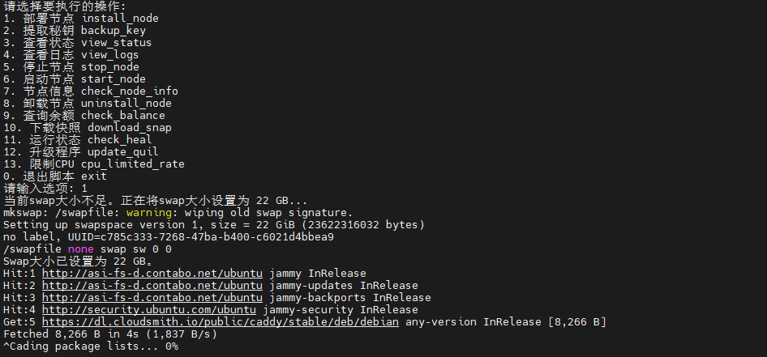
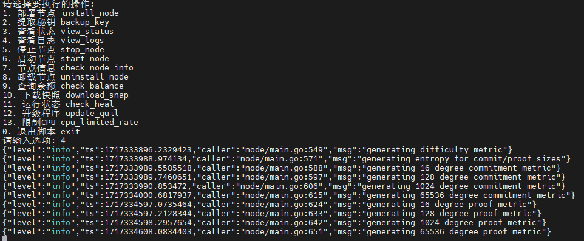
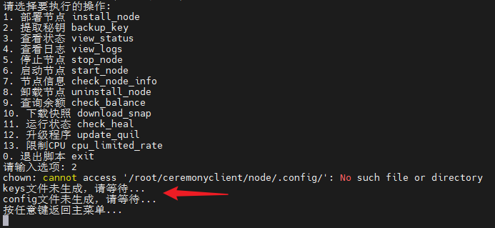
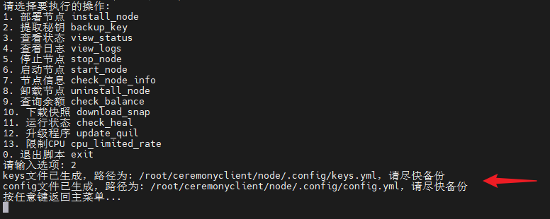
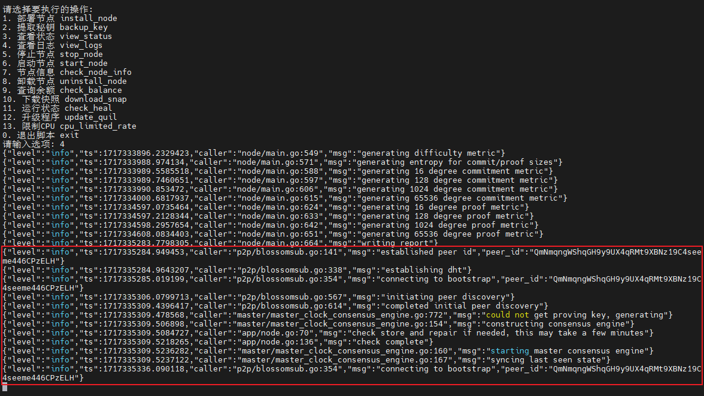
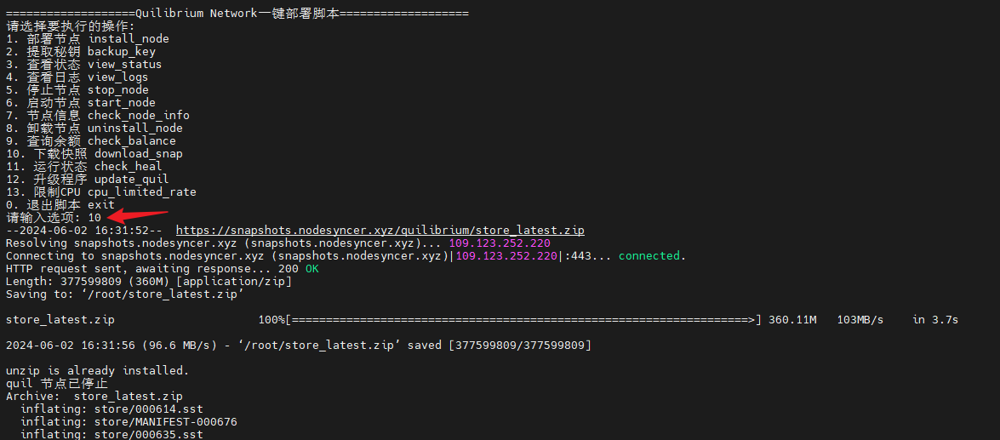

# Quilibrium 节点一键部署教程


Quilibrium 是一种去中心化的互联网层协议，在不牺牲隐私或可扩展性的情况下提供云服务。Quilibrium 旨在打造平台即服务提供商的去中心化替代方案。

**【推荐配置】：12C 16G 250G SSD**

### 1、下载 Quilibrium 节点一键部署脚本

```bash
wget -O quil.sh https://raw.githubusercontent.com/nodesyncer/Quilibrium/main/quil.sh && chmod +x quil.sh && ./quil.sh
```

### 2、输入选项 1，部署节点



### 3、输入选项 4，查看日志



同时点击 `Ctrl + C` 即可返回功能页

### 4、输入选项 2，提取秘钥



本项目不需要创建钱包，官方会在后台自动为大家创建一个秘钥用于识别测试者的身份，部署成功20分钟左右后，选择2即可提取秘钥



### 5、输入选项 10，下载快照

这里需要等待选项4中出现如下内容时即可下载快照



出现上述内容后，输入选项10下载快照



节点部署完毕！
